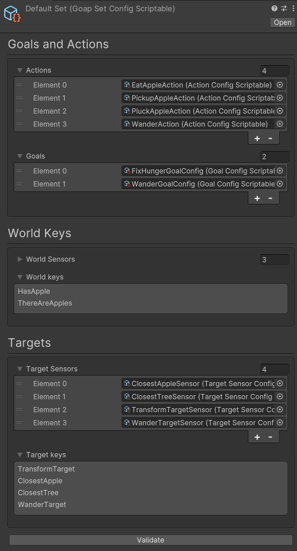

# GoapSet
The `GoapSet` contains all available `Goals` and `Actions` that an agent can use. Different agents can use different `GoapSets`. This allows for different agents to have different `Goals` and `Actions`.



## GoapSet Config
The `GoapSetConfig` is used to configure a `GoapSet`. It contains the following properties:

### goals
The `goals` is a list of `GoalConfigs` that are available to the `Agent`.

### actions
The `actions` is a list of `ActionConfigs` that are available to the `Agent`.

### targetSensors
The `targetSensors` is a list of `TargetSensorConfigs` that are available to the `Agent`.

### worldSensors
The `worldSensors` is a list of `WorldSensorConfigs` that are available to the `Agent`.

## Agent Debugger Class
By defining an agent debugger class you can customize the data show in the node viewer in the `Agent data` box. The agent debugger class must inherit from `IAgentDebugger` and be assigned to the property.


```csharp
using CrashKonijn.Goap.Interfaces;
using Demos.Shared.Behaviours;

public class AgentDebugger : IAgentDebugger
{
    public string GetInfo(IMonoAgent agent, IComponentReference references)
    {
        var hunger = references.GetCachedComponent<HungerBehaviour>();
        
        return $"Hunger: {hunger.hunger}";
    }
}
```

