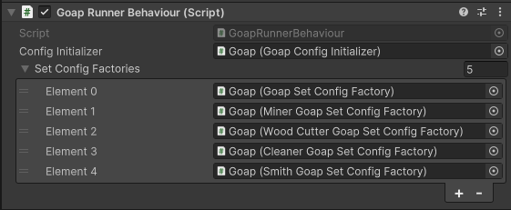

# Config > Code

Setting up your GOAP system using code is the most flexible way to configure your GOAP system. This method is more difficult to use than the `ScriptableObjects` method, but allows for a much more dynamic setup.


**Info** By using code to setup your GOAP system, you can use generic classes. This can make the setup of your GOAP system more flexible.



**Example** The complex demo uses code as the configuration method.


## Sets

To create a set, you must create a class that inherits from `GoapSetFactoryBase`. This class must implement the `Create` method which returns a `IGoapSetConfig`. To make building the set easier, you can use the `GoapSetBuilder` class.


```csharp
using CrashKonijn.Goap.Behaviours;
using CrashKonijn.Goap.Classes.Builders;
using CrashKonijn.Goap.Configs.Interfaces;
using Demos.Complex.Classes;
using Demos.Complex.Classes.Items;
using Demos.Complex.Factories.Extensions;
using Demos.Complex.Interfaces;
using Demos.Shared;

public class GoapSetConfigFactory : GoapSetFactoryBase
{
    public override IGoapSetConfig Create()
    {
        var builder = new GoapSetBuilder("ComplexSet");
        
        // Goals
        builder.AddGoal<WanderGoal>()
            .AddCondition<IsWandering>(Comparison.GreaterThanOrEqual, 1);

        builder.AddGoal<FixHungerGoal>()
            .AddCondition<IsHungry>(Comparison.SmallerThanOrEqual, 0);

        // Actions
        builder.AddAction<WanderAction>()
            .SetTarget<WanderTarget>()
            .AddEffect<IsWandering>(true)
            .SetBaseCost(1f)
            .SetInRange(0.3f);

        builder.AddAction<PickupItemAction<IEatable>>()
            .SetTarget<ClosestTarget<IEatable>>()
            .AddEffect<IsHolding<IEatable>>(true)
            .AddCondition<IsInWorld<IEatable>>(Comparison.GreaterThanOrEqual, 1)
            .SetBaseCost(1f)
            .SetInRange(0.3f);

        // Target Sensors
        builder.AddTargetSensor<WanderTargetSensor>()
            .SetTarget<WanderTarget>();

        builder.AddTargetSensor<ClosestItemSensor<IEatable>>()
            .SetTarget<ClosestTarget<IEatable>>();

        // World Sensors
        builder.AddWorldSensor<IsHoldingSensor<IEatable>>()
            .SetKey<IsHolding<IEatable>>());

        builder.AddWorldSensor<IsInWorldSensor<IEatable>>()
            .SetKey<IsInWorld<IEatable>>();

        return builder.Build();
    }
}
```


### Adding the set to GOAP
Add the created class to a GameObject in the scene. Add it to the list on the `GoapRunnerBehaviour` component. This will initialize the set.



### Adding the set to the agent.
Using a script, set the `GoapSet` property on an agent.


```csharp
var goapRunner = FindObjectOfType<GoapRunnerBehaviour>();
var set = goapRunner.GetSet("ComplexSet");

agent.GetComponent<AgentBehaviour>.GoapSet = set;
```
