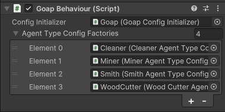

# Config > Code

Setting up your GOAP system using code is the most flexible way to configure your GOAP system. This method is more difficult to use than the `ScriptableObjects` method, but allows for a much more dynamic setup.


**Info** By using code to setup your GOAP system, you can use generic classes. This can make the setup of your GOAP system more flexible.



**Example** The complex demo uses code as the configuration method.


## AgentType

To create an agent type, you must create a class that inherits from `AgentTypeFactoryBase`. This class must implement the `Create` method which returns a `IAgentTypeConfig`. To make building the set easier, you can use the `AgentTypeBuilder` class.


```csharp
using CrashKonijn.Docs.GettingStarted.Capabilities;
using CrashKonijn.Goap.Core;
using CrashKonijn.Goap.Runtime;

namespace CrashKonijn.Docs.GettingStarted.AgentTypes
{
    public class DemoAgentTypeFactory : AgentTypeFactoryBase
    {
        public override IAgentTypeConfig Create()
        {
            var factory = new AgentTypeBuilder("DemoAgent");
            
            factory.AddCapability<IdleCapabilityFactory>();
            factory.AddCapability<PearCapability>();

            return factory.Build();
        }
    }
}

```


## Capabilities

To create a capability, you must create a class that inherits from `CapabilityFactoryBase`. This class must implement the `Create` method which returns a `ICapabilityConfig`. To make building the set easier, you can use the `CapabilityBuilder` class.


```csharp
using CrashKonijn.Docs.GettingStarted.Actions;
using CrashKonijn.Docs.GettingStarted.Sensors;
using CrashKonijn.Goap.Core;
using CrashKonijn.Goap.Runtime;

namespace CrashKonijn.Docs.GettingStarted.Capabilities
{
    public class IdleCapabilityFactory : CapabilityFactoryBase
    {
        public override ICapabilityConfig Create()
        {
            var builder = new CapabilityBuilder("IdleCapability");

            builder.AddGoal<IdleGoal>()
                .AddCondition<IsIdle>(Comparison.GreaterThanOrEqual, 1)
                .SetBaseCost(2);

            builder.AddAction<IdleAction>()
                .AddEffect<IsIdle>(EffectType.Increase)
                .SetTarget<IdleTarget>();

            builder.AddTargetSensor<IdleTargetSensor>()
                .SetTarget<IdleTarget>();
            
            return builder.Build();
        }
    }
}
```


### Callbacks
In v3 you can add a callback to your builder methods, giving you access to the instance of each class. This allows you to set extra data.


```csharp
capability.AddAction<HaulItemAction>()
    .SetCallback((action) =>
    {
        action.CustomData = "Example";
    });
```


### Adding the set to GOAP
Add the created class to a GameObject in the scene. Add it to the list on the `GoapBehaviour` component. This will initialize the set.



### Adding the set to the agent.
Using a script, set the `AgentType` property on an agent.


```csharp
var goap = FindObjectOfType<GoapBehaviour>();
var type = goap.GetAgentType("DemoAgent");

agent.GetComponent<GoapActionProvider>.AgentType = type;
```
