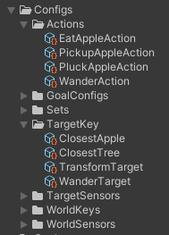

# Config > ScriptableObjects

The ScriptableObjects are the main way to configure the GOAP system. They are used to define the goals, actions, sensors, world keys and target keys. This method of configuration is the most simple way to configure the GOAP system and is done by creating scriptable objects through the Unity Editor. 


**Warning** Please keep in mind that this method prevents you from using generic classes. If you need to use generic classes, you should use the code configuration method.



**Example** The simple demo uses the ScriptableObjects configuration method.


## AgentType

To create an agent type, you must create a new `AgentTypeScriptable` asset in the Unity Editor. This asset contains the configuration for the agent type, including the capabilities it has.

To create a new `AgentTypeScriptable`, right-click in the Project window and select `Create > GOAP > Agent Type`. This will create a new asset that you can customize in the Inspector.

## Capability

To create a capability, you must create a new `CapabilityScriptable` asset in the Unity Editor. This asset contains the configuration for the capability, including the actions, sensors, world keys and target keys it has.

To create a new `CapabilityScriptable`, right-click in the Project window and select `Create > GOAP > Capability`. This will create a new asset that you can customize in the Inspector.

