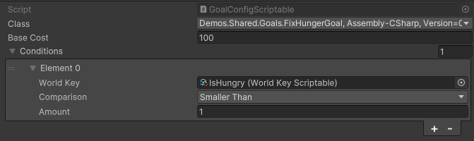
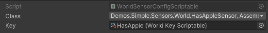
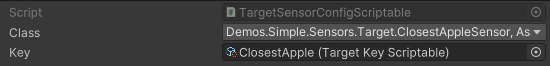

# Config > ScriptableObjects

The ScriptableObjects are the main way to configure the GOAP system. They are used to define the goals, actions, sensors, world keys and target keys. This method of configuration is the most simple way to configure the GOAP system and is done by creating scriptable objects through the Unity Editor. 


**Warning** Please keep in mind that this method prevents you from using generic classes. If you need to use generic classes, you should use the code configuration method.



**Example** The simple demo uses the ScriptableObjects configuration method.


## Sets
To create a set, right click in the project window and select `Create > Goap > Goap Set Config`. This will create a new set config. On this config you must reference all other configs that are part of this set.

## Goals
To create a goal, right click in the project window and select `Create > Goap > Goal Config`. This will create a new goal config.

## Actions
To create an action, right click in the project window and select `Create > Goap > Action Config`. This will create a new action config.

## World Keys
To create an world key, right click in the project window and select `Create > Goap > World Key`. This will create a new world key.

## World Sensors
To create an world sensor, right click in the project window and select `Create > Goap > World Sensor Config`. This will create a new world sensor config.

## Target Keys
To create an action, right click in the project window and select `Create > Goap > Target Key`. This will create a new world key.

## Target Sensors
To create a target sensor, right click in the project window and select `Create > Goap > Target Sensor Config`. This will create a new world sensor config.

