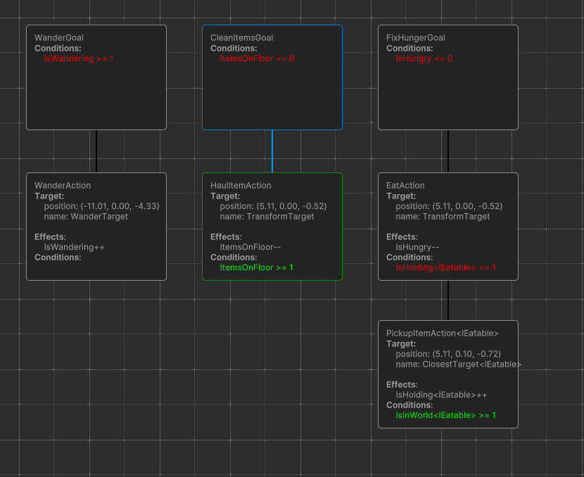
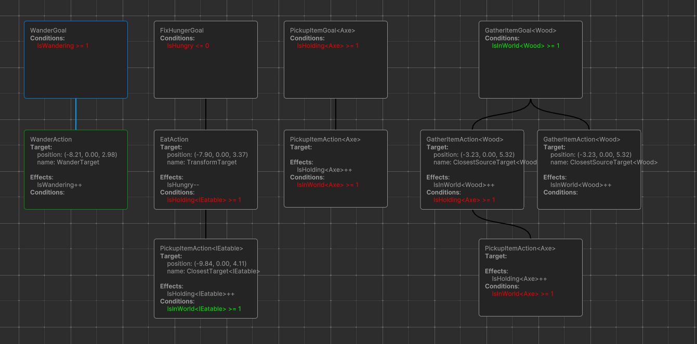
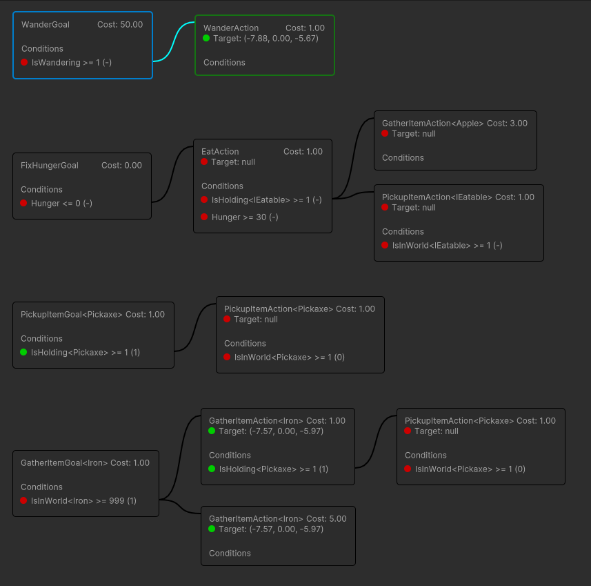

# Examples > Complex

The complex example uses code as the configuration method. The demo scene can be found in `Demos/Complex/Scenes/ComplexDemoScene.unity`.

There are 4 type of agents:
* Cleaner (Orange). They grab items laying on the floor and bring them to boxes.
* Smith (Blue). When there are enough materials he will craft an `Axe` or `Pickaxe`. He needs `Wood` and `Iron` to craft the tools.
* WoodCutter (Green). When there isn't enough `Wood` in the world, they will chop wood from trees.
* Miner (Pink). When there isn't enough `Iron` in the world, they will mine iron from rocks.

Each agent has 2 base goals: `WanderGoal` and `FixHungerGoal`. The `WanderGoal` will make the agent wander around the scene. The `FixHungerGoal` will make the agent eat apples. The agent will only eat apples if it is hungry. The agent will only wander if it is not hungry.

## Cleaner
The goap set builder can be found in `Demos/Complex/Factories/CleanerGoapSetConfigFactory.cs`.

## Smith
The goap set builder can be found in `Demos/Complex/Factories/SmithGoapSetConfigFactory.cs`.

## Wood Cutter
The goap set builder can be found in `Demos/Complex/Factories/WoodCutterGoapSetConfigFactory.cs`.

## Miner
The goap set builder can be found in `Demos/Complex/Factories/MinerGoapSetConfigFactory.cs`.

