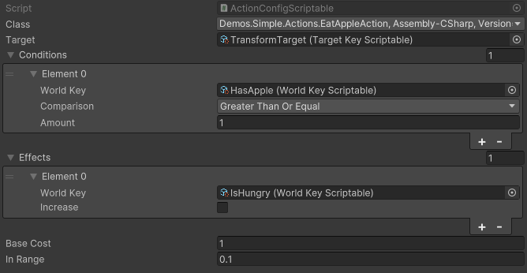

# Conditions and Effects

## Conditions
Conditions are essentially the prerequisites or requirements that need to be met for an action to be executed. They are tied to the game's state, represented by `WorldKey`.

- **Key**: This is the `WorldKey` that the condition checks. Think of it as a variable or a state in the game world, like "PlayerHealth" or "HasAmmo."

- **Comparison**: This is how the `WorldKey` is compared to a specific value to determine if the condition is met. The available comparisons are "SmallerThan," "SmallerThanOrEqual," "GreaterThan," and "GreaterThanOrEqual."

- **Value**: This is the specific value that the `WorldKey` is compared against using the specified comparison.

For example, a condition might be set up like this:
- **Key**: PlayerHealth
- **Comparison**: GreaterThan
- **Value**: 50

This condition checks if the player's health is greater than 50.

## Effects
Effects describe the changes that an action brings about in the game's state, again represented by `WorldKey`.

- **Key**: This is the `WorldKey` that the effect modifies. For instance, "PlayerHealth" or "AmmoCount."

- **Type**: This indicates whether the `WorldKey` value will increase or decrease as a result of the action.

For instance, an effect might be:
- **Key**: AmmoCount
- **Type**: Decrease

This effect would decrease the ammo count when the action is executed.

## Matching Conditions and Effects

The system matches conditions and effects to determine the sequence of actions that lead to a goal. Here's how the matching works based on the provided documentation:

- **SmallerThan** and **SmallerThanOrEqual** comparisons in conditions look for actions with **negative effects**. This means if a condition requires a `WorldKey` to be less than a certain value, the system will look for actions that decrease that `WorldKey`.

- **GreaterThan** and **GreaterThanOrEqual** comparisons in conditions look for actions with **positive effects**. So, if a condition requires a `WorldKey` to be greater than a certain value, the system will search for actions that increase that `WorldKey`.

For example, if there's a condition that checks if "AmmoCount" is `SmallerThan` 5, the system might look for an action with a negative effect on "AmmoCount" (like "ShootBullet"). Conversely, if the condition checks if "AmmoCount" is `GreaterThan` 10, the system might look for an action with a positive effect on "AmmoCount" (like "ReloadGun").

In essence, the GOAP system uses these conditions and effects to build a graph of possible actions and sequences, which is then used by the planner to determine the best course of action to achieve a goal.

## Examples

Setting conditions and effects through code.


```csharp
var builder = new GoapSetBuilder("GettingStartedSet");

builder.AddAction<ShootBullet>()
           .AddCondition<AmmoCount>(Comparison.GreaterThanOrEqual, 1)
           .AddEffect<AmmoCount>(false)
```


Setting conditions and effects through the inspector.

