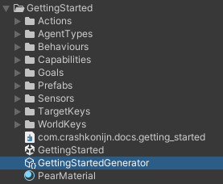
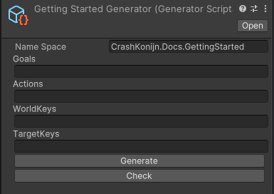

# GOAP Generator

The GOAP Generator is a core component of the GOAP framework, designed to facilitate the quick creation of goals, actions, and target keys within the system. It is implemented as a `ScriptableObject` in Unity, allowing developers to easily create and manage instances within the Unity Editor.

## Overview

The `GeneratorScriptable` class can be used to quickly boilerplate `Goals`, `Actions`, `WorldKeys` and `TargetKeys` for the GOAP system. This is particularly useful when setting up a new project or adding new elements to an existing one.

## Usage
To use the generator, add a new one to your project by right-clicking in the Project window and selecting `Create > GOAP > Generator`. This will create a new `GeneratorScriptable` asset that you can customize in the Inspector.

All scripts created by the generator will be placed in subfolders according to their types.

