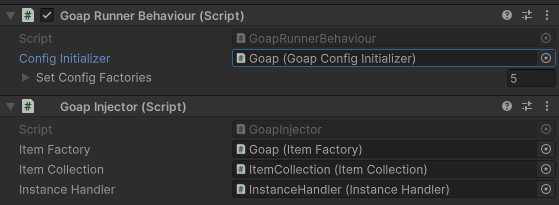

# Injection

`Goals`, `Actions` and `Sensors` are all classes managed and created by the GOAP. Sometimes you want to inject data about a scene into these classes. This can be done by creating an injector.

## Creating an injector
Create a `MonoBehaviour` class that implements the `IGoapInjector` interface. The methods of this class are called right after each class is created. You can use this to implement your own injection logic or implement third party injection libraries.

### Example
This is a simple example of an injector that is used in the complex example scene. It injects itself into Actions that implement the `IInjectable` interface. 


```csharp
using CrashKonijn.Goap.Interfaces;

public class GoapInjector : MonoBehaviour, IGoapInjector
{
    public ItemFactory itemFactory;
    public ItemCollection itemCollection;
    public InstanceHandler instanceHandler;
    
    public void Inject(IActionBase action)
    {
        if (action is IInjectable injectable)
            injectable.Inject(this);
    }

    public void Inject(IGoalBase goal)
    {
    }

    public void Inject(IWorldSensor worldSensor)
    {
    }

    public void Inject(ITargetSensor targetSensor)
    {
    }
}
```



```csharp
namespace Demos.Complex.Actions
{
    public class CreateItemAction<TCreatable> : ActionBase<CreateItemAction<TCreatable>.Data>, IInjectable
        where TCreatable : ItemBase, ICreatable
    {
        private ItemFactory itemFactory;
        private InstanceHandler instanceHandler;

        public void Inject(GoapInjector injector)
        {
            this.itemFactory = injector.itemFactory;
            this.instanceHandler = injector.instanceHandler;
        }
        
        // rest of class
    }
}
```


### Zenject
It's very easy to use Zenject with the GOAP. The GOAP has a built in injector that can be used to inject Zenject dependencies into the GOAP classes.


```csharp
using CrashKonijn.Goap.Interfaces;
using UnityEngine;
using Zenject;

public class ZenjectGoapInjector : MonoBehaviour, IGoapInjector
{
    private DiContainer container;

    [Inject]
    private void Construct(DiContainer container)
    {
        this.container = container;
    }
    
    public void Inject(IActionBase action)
    {
        this.container.Inject(action);
    }

    public void Inject(IGoalBase goal)
    {
        this.container.Inject(goal);
    }

    public void Inject(IWorldSensor worldSensor)
    {
        this.container.Inject(worldSensor);
    }

    public void Inject(ITargetSensor targetSensor)
    {
        this.container.Inject(targetSensor);
    }
}
```


## Connecting the injector
In order to let the GOAP know you'd like to overwrite one of it's core settings, the `IGoapInjector` in this case you need to create a class that extends `GoapConfigInitializerBase`.

Add the script to the scene and bind it to the `GoapConfigInitializer` property of the `GoapRunnerBehaviour` component.



### Example


```csharp
using CrashKonijn.Goap.Behaviours;
using CrashKonijn.Goap.Classes;

namespace Demos.Complex.Goap
{
    public class GoapConfigInitializer : GoapConfigInitializerBase
    {
        public override void InitConfig(GoapConfig config)
        {
            config.GoapInjector = this.GetComponent<GoapInjector>();
        }
    }
}
```
