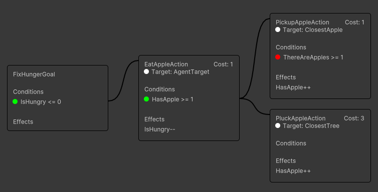
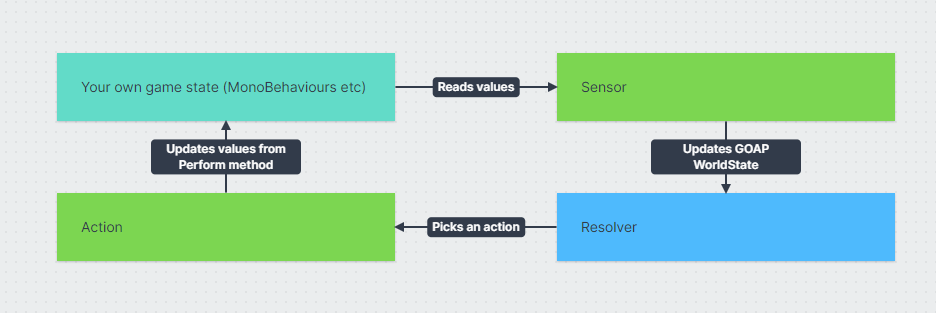

# Getting Started

## Tutorials

* [**YouTube tutorials**](https://www.youtube.com/playlist?list=PLZWmMt\_TbeYeatHa9hntDPu4zGEBAFffn) on how to use the library.
* [**YouTube references**](https://www.youtube.com/playlist?list=PLZWmMt\_TbeYdBZKvlsRuuOubPTTfPuZot) discussing GOAP in general.

## Installation

Add the package to your project using the package manager. Add the following URL to the package manager:

```
https://github.com/crashkonijn/GOAP.git?path=/Package#3.0.22-beta
```

Alternatively install through [OpenUPM](https://openupm.com/packages/com.crashkonijn.goap/) or the [Unity Asset Store](https://assetstore.unity.com/packages/slug/252687).


**Version** This package was build using unity 2022.2. Any newer version should work!


## What is included in this library

This library provides the following:
- Everything you need to create, manage, run and debug your own GOAP setup.
- It can resolve the best action to perform based on the current state of the world, for a given (set of) goal(s).
- It provides an agent that can actually run the actions.


Deciding what the best goal is to perform is very game specific and as such this library doesn't provide any tools to help you with that. Any algorithm that fits your game best could be used to determine the best goal to perform. The examples use a simple FSM to determine the best goal, but you could also use a utility system, behavior trees, etc.


## How does GOAP work
The GOAP algorithm is a way to determine the best action to perform based on the current state of the world and a set of goals. The algorithm works by creating a tree of possible actions and then selecting the best path through that tree to reach the goal. The algorithm is based on the A* algorithm, but with some modifications to make it work better for GOAP.

GOAP uses two algorithms to work:
1. The first algorithm is the `GraphBuilder`. It uses your configuration of goals, actions, conditions and effects to build a graph of possible actions their connections. This is only done once whenever a new `AgentType` is created.
2. The second algorithm is the `Resolver`. It uses the graph created by the `GraphBuilder` to determine the best path through the graph to reach the goal based on the current game state. The algorithm does this in reverse, starting from the goal and working its way back until it finds an action that can be performed.

## Graph Builder
The graph builder requires the following information to build the graph:
- **Goals**: The goals that the agent can try to achieve.
  - Each goal has a list of conditions that need to be met to achieve the goal.
- **Actions**: The actions that the agent can perform.
  - Each action has a list of conditions that need to be met to perform the action.
  - Each action has a list of effects that the action has on the world.
- **Conditions**: The conditions that are required to perform an action (or complete a goal)
  - Each condition references a `WorldKey`, comparison and a value.
  - For example `AppleCount` `GreaterThanOrEqual` `5`.
- **Effects**: The effects that a action has on the world.
  - Each effect references a `WorldKey`, an `Effect Direction`.
  - For example `AppleCount` `Increase`.
  - Important: The system doesn't apply any effects to the world, it's up to you to do this. The system only uses the effects direction to determine its connection to conditions.
- **WorldKeys**: The keys that are used in the conditions and effects. Each `WorldKey` belongs to a value in the world.
  - For example `AppleCount`.

Based on their conditions and effects the GraphBuilder can connect them to each other. For example a condition of `AppleCount >= 5` can be connected to an action that `increases` the `AppleCount`.



## Resolver
The resolver uses the current `WorldState` and the `Graph` to determine the action with the lowest `Cost` that can be performed to reach a goal.

In order to prevent you from having to create a `MoveToXAction` before every action, you can assign a `TargetKey` to an `Action`. This `TargetKey` represents a position in the world where an action can take place, the `Agent` will move there before performing the action and the resolver will also take this into account when determining the best action to perform.

## WorldState
The resolver uses the graph created by the `GraphBuilder` to determine the best action to perform based on the current `WorldState` and the currently requested `Action(s)`.

To let the resolver know what the current state of the world is, you need to provide this information using a `Sensor`. A sensor can read a value from you own `MonoBehaviours` and provide this information to the resolver when it's needed.

There are two types of keys that can be used in the `WorldState`:
- **WorldKey**: A WorldKey references a value in the world. For example `AppleCount`. All values must be represented by `ints`.
- **TargetKey**: A TargetKey references a position in the world. For example `AppleTree`. All positions must be represented by `Vector3`.

## Sensors
A `Sensor` is a class that reads the current state of the world and provides this information to the `WorldState` when it's needed.  The `Resolver` uses this information to determine the best action to perform based on the current state of the world.

Sensors can provide the values for two types of data/keys:
- **WorldKey**: A WorldKey references a value in the world. For example `AppleCount`. All values must be represented by `ints`.
- **TargetKey**: A TargetKey references a position in the world. For example `AppleTree`. All positions must be represented by `Vector3`.

Sensors can work in two scopes: `Global` or `Local`.

- **Global**: These sensors give information for all agents of an `AgentType`. For instance, `IsDaytimeSensor` checks if it's day or night for everyone.
- **Local**: They give information for just one agent. For example, `ClosestAppleSensor` finds the nearest apple for a specific agent.




## Action Provider
An `ActionProvider` (in this case always the `GoapActionProvider`) is a class that uses the `Resolver` to determine the best action to perform based on the current `WorldState` and the currently requested `Action(s)`. The `ActionProvider` then sets the `Action` that the `Agent` should perform.

The GOAP system itself doesn't know anything about how to run actions.

## Agent
An `Agent` is any GameObject that holds the `AgentBehaviour` script. The `AgentBehaviour` is responsible for running the actions that are set by the `ActionProvider`. The `AgentBehaviour` will run any action given to it until the action is completed or stopped. If an action requires to be performed at a specific position, the agent will move to that position before performing the action.

## Overview

Below is a quick overview of the different components of classes and how they are connected to an Action.


