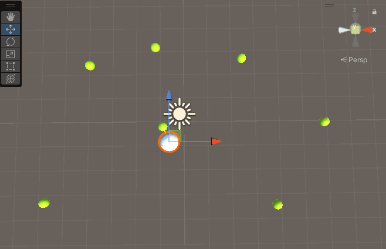
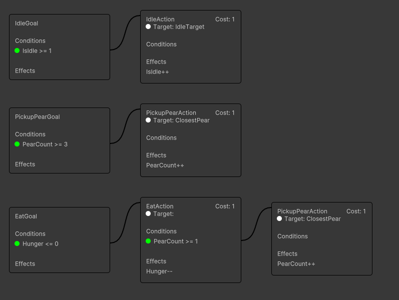

# Pears

In this part of the tutorial we will add a `PickupPearGoal` and let the agent pickup pears if it comes close to them.

# Creating the classes

1. Let's start by boiler plating the files that we need. Use the generator to create the following files:
    - Goals: `PickupPearGoal`, `EatGoal`
    - Actions: `PickupPearAction`, `EatAction`
    - WorldKeys: `PearCount`, `Hunger`
    - TargetKeys: `ClosestPear`

2. We will implement the classes in a bit, first let's make sure that we know what pears are. Create a new class called `PearBehaviour` in the `Behaviours` folder and add the following code:


```csharp
using UnityEngine;

namespace CrashKonijn.Docs.GettingStarted.Behaviours
{
    public class PearBehaviour : MonoBehaviour
    {
    }
}
```


3. In our scene, create a new GameObject using `GameObject > 3D Object > Sphere`. Rename the object to `Pear` and add the `PearBehaviour` component to it. Pears are generally smaller than agents, so let's adjust the scale to `0.5` on all axes. You can remove the collider as we won't need it.
4. Let's create a new material for the pear. Right-click in the `Assets` folder and select `Create > Material`. Rename the material to `PearMaterial` and change the color to a nice yellow/green. Drag the material onto the `Pear` object.
5. In the `GettingStarted` folder let's create a new folder called `Prefabs`. Drag the `Pear` object into this folder to create a prefab.
6. Let's duplicate the pear a couple of times in the scene and place them in different locations.

7. For these actions we need data that represents the `PearCount` and `Hunger` values. The **source of truth** for these values must be our own `MonoBehaviours`. Let's create a script called `DataBehaviour` in the `Behaviours` folder and add the following code:


```csharp
using System;
using UnityEngine;

namespace CrashKonijn.Docs.GettingStarted.Behaviours
{
    public class DataBehaviour : MonoBehaviour
    {
        public int pearCount = 0;
        public float hunger = 0f;
        
        private void Update()
        {
            // For simplicity, we will increase the hunger over time in this class.
            this.hunger += Time.deltaTime * 5f;
        }
    }
}
```


8. Add the new `DataBehaviour` to the `Agent` object in the scene.

9. Create the sensors required for the `PearCount` and `ClosestPear` keys. This time we'll use something called a `MultiSensor`. This sensor can provide multiple keys at once. Create a new class called `PearSensor` in the `Sensors` folder and inherit from `MultiSensorBase`.


```csharp
using System;
using System.Collections.Generic;
using CrashKonijn.Docs.GettingStarted.Behaviours;
using CrashKonijn.Goap.Runtime;
using UnityEngine;

namespace CrashKonijn.Docs.GettingStarted.Sensors
{
    public class PearSensor : MultiSensorBase
    {
        // A cache of all the pears in the world
        private PearBehaviour[] pears;

        // You must use the constructor to register all the sensors
        // This can also be called outside of the gameplay loop to validate the configuration
        public PearSensor()
        {
            this.AddLocalWorldSensor<PearCount>((agent, references) =>
            {
                // Get a cached reference to the DataBehaviour on the agent
                var data = references.GetCachedComponent<DataBehaviour>();

                return data.pearCount;
            });
            
            this.AddLocalWorldSensor<Hunger>((agent, references) =>
            {
                // Get a cached reference to the DataBehaviour on the agent
                var data = references.GetCachedComponent<DataBehaviour>();

                // We need to cast the float to an int, because the hunger is an int
                // We will lose the decimal values, but we don't need them for this example
                return (int) data.hunger;
            });
            
            this.AddLocalTargetSensor<ClosestPear>((agent, references, target) =>
            {
                // Use the cashed pears list to find the closest pear
                var closestPear = this.Closest(this.pears, agent.Transform.position);
                
                if (closestPear == null)
                    return null;
                
                // If the target is a transform target, set the target to the closest pear
                if (target is TransformTarget transformTarget)
                    return transformTarget.SetTransform(closestPear.transform);
                
                return new TransformTarget(closestPear.transform);
            });
        }

        // The Created method is called when the sensor is created
        // This can be used to gather references to objects in the scene
        public override void Created()
        {
        }
        
        // This method is equal to the Update method of a local sensor.
        // It can be used to cache data, like gathering a list of all pears in the scene.
        public override void Update()
        {
            this.pears = GameObject.FindObjectsOfType<PearBehaviour>();
        }

        // Returns the closest item in a list
        private T Closest<T>(IEnumerable<T> list, Vector3 position)
            where T : MonoBehaviour
        {
            T closest = null;
            var closestDistance = float.MaxValue; // Start with the largest possible distance

            foreach (var item in list)
            {
                var distance = Vector3.Distance(item.gameObject.transform.position, position);
                
                if (!(distance < closestDistance))
                    continue;
                
                closest = item;
                closestDistance = distance;
            }

            return closest;
        }
    }
}
```


## Editing the PickupPearAction
Let's implement the `PickupPearAction` so it actually performs the action of picking up a pear.


```csharp
using CrashKonijn.Agent.Core;
using CrashKonijn.Agent.Runtime;
using CrashKonijn.Docs.GettingStarted.Behaviours;
using CrashKonijn.Goap.Runtime;
using UnityEngine;

namespace CrashKonijn.Docs.GettingStarted.Actions
{
    [GoapId("PickupPear-06ef21a4-059b-4314-800a-e7c2622637fb")]
    public class PickupPearAction : GoapActionBase<PickupPearAction.Data>
    {
        // This method is called every frame while the action is running
        public override IActionRunState Perform(IMonoAgent agent, Data data, IActionContext context)
        {
            // Instead of using a timer, we can use the Wait ActionRunState.
            // The system will wait for the specified time before completing the action
            // Whilst waiting, the Perform method won't be called again
            return ActionRunState.WaitThenComplete(0.5f);
        }

        // This method is called when the action is completed
        public override void Complete(IMonoAgent agent, Data data)
        {
            if (data.Target is not TransformTarget transformTarget)
                return;
            
            data.DataBehaviour.pearCount++;
            GameObject.Destroy(transformTarget.Transform.gameObject);
        }

        // The action class itself must be stateless!
        // All data should be stored in the data class
        public class Data : IActionData
        {
            public ITarget Target { get; set; }
            
            // When using the GetComponent attribute, the system will automatically inject the reference
            [GetComponent]
            public DataBehaviour DataBehaviour { get; set; }
        }
    }
}
```


## Configuring the PickupPearGoal


1. In the `Capabilities` folder let's create the `PearCapability` class and add the following code:


```csharp
using CrashKonijn.Docs.GettingStarted.Actions;
using CrashKonijn.Goap.Core;
using CrashKonijn.Goap.Runtime;

namespace CrashKonijn.Docs.GettingStarted.Capabilities
{
    public class PearCapability : CapabilityFactoryBase
    {
        public override ICapabilityConfig Create()
        {
            var builder = new CapabilityBuilder("PearCapability");

            builder.AddGoal<PickupPearGoal>()
                .AddCondition<PearCount>(Comparison.GreaterThanOrEqual, 3);
            
            builder.AddAction<PickupPearAction>()
                .AddEffect<PearCount>(EffectType.Increase)
                .SetTarget<ClosestPear>();

            return builder.Build();
        }
    }
}
```


2. Edit the `DemoAgentTypeFactory` and add the `PearCapability` to the list of capabilities.


```csharp
factory.AddCapability<PearCapability>();
```





1. In the `Capabilities` folder create a new `CapabilityConfig` asset and name it `PearCapability`.
2. Add a new `Goal`, select the `PickupPearGoal` and add a condition of `PearCount` `GreaterThanOrEqual` `3`.
3. Add a new `Action`, select the `PickupPearAction` and add an effect of `PearCount` `Increase`. Set the target to `ClosestPear`.
4. Add a new MultiSensor and select the `PearSensor`.
5. Select the `DemoAgentTypeConfig` and add the `PearCapability` to the list of capabilities.



## Adding the PickupPearGoal to the brain.
1. Adjust the `RequestGoal` call in our `BrainBehaviour` to include the `PickupPearGoal`.


```csharp
this.provider.RequestGoal<IdleGoal, PickupPearGoal>();
```


2. Start the scene and watch the agent pickup pears when it comes close enough!



You graph should now look like this:


# Adding the EatGoal and EatAction

## Adjusting the EatAction

1. Let's adjust the `EatAction` to consume the pears that the agent has picked up.


```csharp
using CrashKonijn.Agent.Core;
using CrashKonijn.Agent.Runtime;
using CrashKonijn.Docs.GettingStarted.Behaviours;
using CrashKonijn.Goap.Runtime;

namespace CrashKonijn.Docs.GettingStarted.Actions
{
    [GoapId("Eat-b235695c-727b-41a5-aa66-4757ce65719d")]
    public class EatAction : GoapActionBase<EatAction.Data>
    {
        // This method is called every frame while the action is running
        public override IActionRunState Perform(IMonoAgent agent, Data data, IActionContext context)
        {
            // Instead of using a timer, we can use the Wait ActionRunState.
            // The system will wait for the specified time before completing the action
            // Whilst waiting, the Perform method won't be called again
            return ActionRunState.WaitThenComplete(5f);
        }

        // This method is called when the action is completed
        public override void Complete(IMonoAgent agent, Data data)
        {
            data.DataBehaviour.pearCount--;
            data.DataBehaviour.hunger = 0f;
        }

        // The action class itself must be stateless!
        // All data should be stored in the data class
        public class Data : IActionData
        {
            public ITarget Target { get; set; }
            
            // When using the GetComponent attribute, the system will automatically inject the reference
            [GetComponent]
            public DataBehaviour DataBehaviour { get; set; }
        }
    }
}
```


## Creating the EatCapability

1. This is your time to shine, create a new capability called `EatCapability` that uses the `EatGoal` and `EatAction`.

```
EatGoal
   Conditions
      - Hunger <= 0
      
EatAction
   Effects
      - Hunger--
   Conditions
      - PearCount >= 1
   Target: none
   RequiresTarget: false
```

2. Add the capability to you agent type.

## Adjusting the brain

Let's adjust the `BrainBehaviour` to include the `EatGoal` when the hunger is higher than 50!


```csharp
using System;
using CrashKonijn.Agent.Core;
using CrashKonijn.Agent.Runtime;
using CrashKonijn.Goap.Runtime;
using UnityEngine;

namespace CrashKonijn.Docs.GettingStarted.Behaviours
{
    public class BrainBehaviour : MonoBehaviour
    {
        private AgentBehaviour agent;
        private GoapActionProvider provider;
        private GoapBehaviour goap;
        private DataBehaviour data;
        
        private void Awake()
        {
            this.goap = FindObjectOfType<GoapBehaviour>();
            this.agent = this.GetComponent<AgentBehaviour>();
            this.provider = this.GetComponent<GoapActionProvider>();
            this.data = this.GetComponent<DataBehaviour>();
            
            // This only applies sto the code demo
            if (this.provider.AgentTypeBehaviour == null)
                this.provider.AgentType = this.goap.GetAgentType("DemoAgent");
        }

        private void Start()
        {
            this.provider.RequestGoal<IdleGoal, PickupPearGoal>();
        }

        private void OnEnable()
        {
            this.agent.Events.OnActionEnd += this.OnActionEnd;
        }

        private void OnDisable()
        {
            this.agent.Events.OnActionEnd -= this.OnActionEnd;
        }

        private void OnActionEnd(IAction action)
        {
            if (this.data.hunger > 50)
            {
                this.provider.RequestGoal<EatGoal>();
                return;
            }
            
            this.provider.RequestGoal<IdleGoal, PickupPearGoal>();
        }
    }
}
```


## A mixed graph

Play the scene and watch the agent eat the pears when it's hungry!

Your graph should now look like this. As you can see the actions of the different capabilities are mixed into a single graph. The `PickupPearAction` can now also be performed when the `EatGoal` is active.

