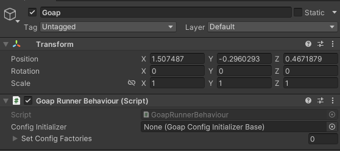
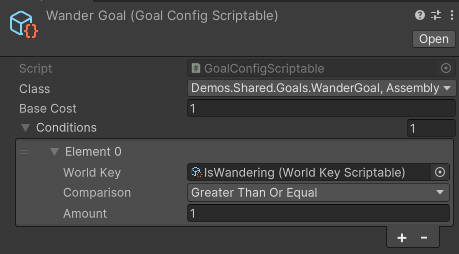
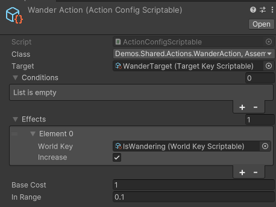
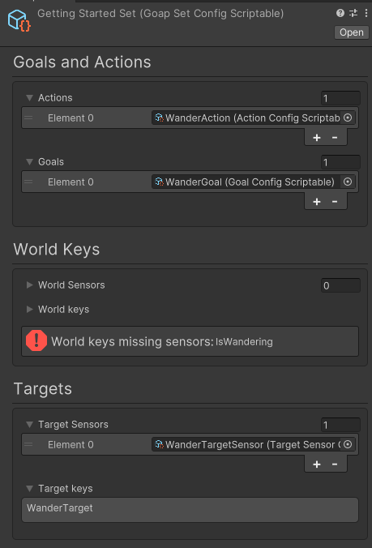
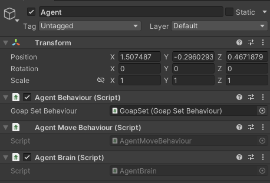

# Getting Started > ScriptableObjects

## Setup in Unity

1. Create a new scene
2. Create a new GameObject called `Goap`, add the `GoapRunnerBehaviour` to it.

3. Create a folder called `Configs`.
4. Within the `Configs` folder create a folder called `TargetKeys`. Within this folder press right click `Create > GOAP > Target Key Config`. Call the config `WanderTarget`.
5. Within the `Configs` folder create a folder called `WorldKeys`. Within this folder press right click `Create > GOAP > World Key Config`. Call the config `IsWandering`.
6. Within the `Configs` folder create a folder called `Goals`. Within this folder press right click `Create > GOAP > Goal Config`. Call the config `WanderGoal`.
   1. Select the `WanderGoal` script in the `class` property.
   2. Add a condition to the `conditions` property. Set the `key` to `IsWandering`, the `comparison` to `GreaterThanOrEqual` and the `value` to `1`.

7. Within the `Configs` folder create a folder called `Actions`. Within this folder press right click `Create > GOAP > Action Config`. Call the config `WanderAction`.
   1. Select the `WanderAction` script in the `class` property.
   2. Set the `target` to `WanderTarget`.
   3. Add an effect to the `effects` property. Set the `key` to `IsWandering`, the `increase` to `true`.

8. Within the `Configs` folder create a folder called `TargetSensors`. Within this folder press right click `Create > GOAP > Target Sensor Config`. Call the config `WanderTargetSensor`.
   1. Select the `WanderTargetSensor` script in the `class` property.
   2. Set the `key` to `WanderTarget`.

9. Within the `Configs` folder create a folder called `Sets`. Within this folder press right click `Create > GOAP > Goap Set Config`. Call the config `GettingStartedSet`.
   1. Add the `WanderGoal` config to the `goals` property.
   2. Add the `WanderAction` config to the `actions` property.
   3. Add the `WanderTargetSensor` config to the `targetSensors` property.

10. In the scene, add a GameObject called `GoapSet`. Add the `GoapSetBehaviour` to it.
    1. In the `Config` property of the `GoapSetBehaviour` select the `GettingStartedSet` config.
    2. In the `Runner` property of the `GoapSetBehaviour` select the `Goap` GameObject.

11. Create a sphere `GameObject` called `Agent`. Add the `AgentBehaviour`, `AgentMoveBehaviour` and `AgentBrain` to the `GameObject`.
    1. In the `GoapSetConfig` property of the `AgentBehaviour` select the `GoapSet` GameObject.

12. Run the scene. The agent should move around randomly.