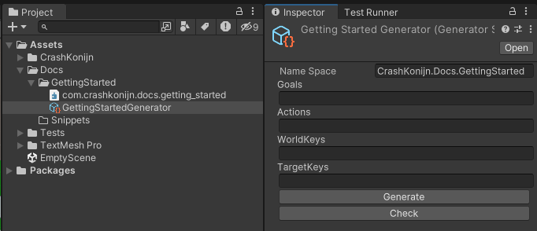
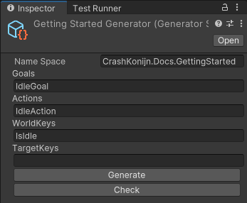
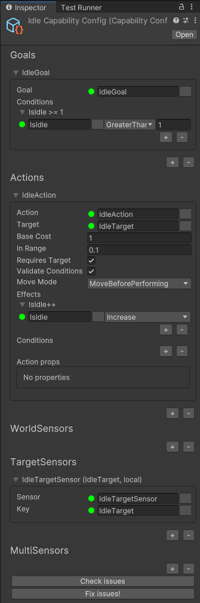
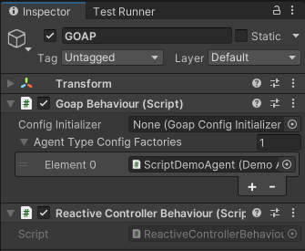
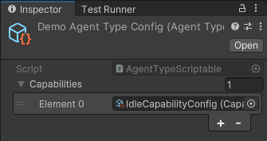
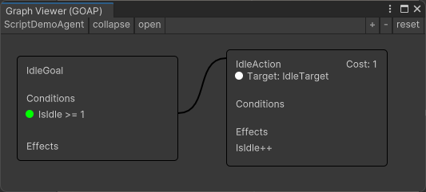
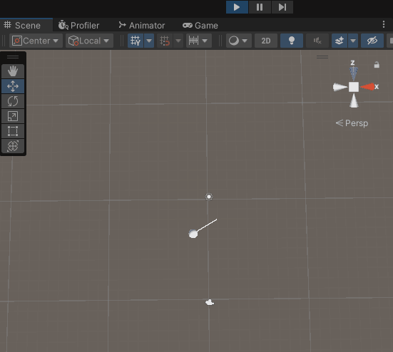
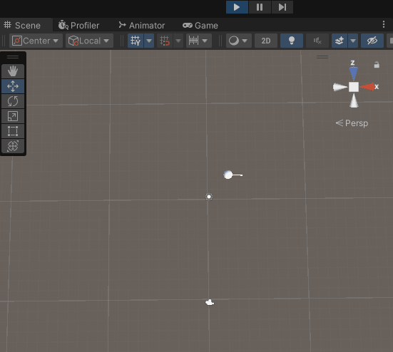

# Setup

## Goal
In this tutorial we will create a simple GOAP system that will make an agent wander around when idle. The agent can also pick up apples and eat them. The agent will only eat apples when it's hungry.

## Setup in Unity

1. The package comes with a `Generator Scriptable` that can help you quickly boilerplate all the classes that are used by the GOAP system. Let's get started by creating a new location for our scripts to go. Create a new folder called `Getting Started` in your `Assets` folder.
2. Right-click the `Getting Started` folder and select `Create > GOAP > Generator`. Call the scriptable `GettingStartedGenerator`.
3. When you select the `GettingStartedGenerator` you can see all it's properties in the inspector. The generator requires you to set a base namespace in the inspector. To make following the getting started easier, please set the namespace to `CrashKonijn.Docs.GettingStarted`.
   
   

4. If you like using assembly definitions you can add it to the `Getting Started` folder. Please make sure to also set the `Root Namespace` to `CrashKonijn.Docs.GettingStarted`. Also make sure to include the `com.crashkonijn.goap.core`, `com.crashkonijn.goap.runtime`, `com.crashkonijn.agent.core` and `com.crashkonijn.agent.runtime` assemblies.

   

## Generating classes
1. Let's generate the required `Goals`, `Actions`, `WorldKeys` and `TargetKeys` using the generator. In the inspector of the `GettingStartedGenerator` please fill in the following classes in their respective fields:
   - Goals: `IdleGoal`
   - Actions: `IdleAction`
   - WorldKeys: `IsIdle`
   - TargetKeys: `IdleTarget`
   
   

2. Hit the `Generate` button! The generator will now create all the classes for you. Unity doesn't always register the new files, you can fix this by going to another program and then going back to Unity. All the classes should now be visible in the `Getting Started` folder, in their respective subfolders.
3. Later on we also need sensor classes, but these can't be generated by the generator.

## Sensors
Each `WorldKey` or `TargetKey` that is used in general also needs a value assigned to it. To get this value we use `Sensors`. Sensors are classes that can read the current state of the world and provide this information to the `WorldState` when it's needed.

In this part of the demo we use two keys, the `IsIdle (WorldKey)` and the `IdleTarget (TargetKey)`. The `IsIdle` key in this example is mostly used to match the `IdleGoal` and `IdleAction` together, it doesn't actually require to actually update the value. 'Manually' coupling a goal and action together is generally bad practice, but for this demo it's fine.

The `IdleTarget` key does need a value, so we need to create a sensor for it. To create a sensor we need to use the correct base class. The correct base class is determined by the `Type` of key (Eg `WorldKey` or `TargetKey`) and the `Scope` of the sensor (Eg `Global` or `Local`). Global sensors are used to provide information for all agents (eg `PlayerPosition`), while local sensors are used to provide information for a single agent (eg `ClosestTree`).

|           | Local                 | Global                 |
|-----------|-----------------------|------------------------|
| WorldKey  | LocalWorldSensorBase  | GlobalWorldSensorBase  |
| TargetKey | LocalTargetSensorBase | GlobalTargetSensorBase |

In this case the `IdleTarget` is a `TargetKey` and it is for a single `Agent`, so we require the `LocalTargetSensorBase`.

1. Let's create a new folder in the `Getting Started` folder called `Sensors`.
2. In the `Sensors` folder create a new script called `IdleTargetSensor` that extends `LocalTargetSensorBase`.


```csharp
using CrashKonijn.Agent.Core;
using CrashKonijn.Goap.Runtime;
using UnityEngine;

namespace CrashKonijn.Docs.GettingStarted.Sensors
{
    public class IdleTargetSensor : LocalTargetSensorBase
    {
        private static readonly Vector2 Bounds = new Vector2(15, 8);
        
        // Is called when this script is initialzed
        public override void Created()
        {
            
        }

        // Is called every frame that an agent of an `AgentType` that uses this sensor needs it.
        // This can be used to 'cache' data that is used in the `Sense` method.
        // Eg look up all the trees in the scene, and then find the closest one in the Sense method.
        public override void Update()
        {
            
        }

        public override ITarget Sense(IActionReceiver agent, IComponentReference references, ITarget existingTarget)
        {
            var random = this.GetRandomPosition(agent);
            
            // If the existing target is a `PositionTarget`, we can reuse it and just update the position.
            if (existingTarget is PositionTarget positionTarget)
            {
                return positionTarget.SetPosition(random);
            }
            
            return new PositionTarget(random);
        }
        
        private Vector3 GetRandomPosition(IActionReceiver agent)
        {
            while (true)
            {
                var random = Random.insideUnitCircle * 3f;
                var position = agent.Transform.position + new Vector3(random.x, 0f, random.y);

                if (position.x > -Bounds.x && position.x < Bounds.x && position.z > -Bounds.y && position.z < Bounds.y)
                    return position;
            }
        }
    }
}
```


## ScriptableObjects or Code
The GOAP system can be setup in two ways. You can either use `Code` or `ScriptableObjects`. The `Code` way is more flexible and allows you to create your own setup systems and use generics. The `ScriptableObjects` way is more visual and allows you to set up the system in the Unity Editor. Please pick the one that fits your project best.

## Creating the scene
1. In the `Getting Started` folder create a new scene called `GettingStarted`. Open this scene.

## Adding the GOAP system
1. Create a new GameObject and name it `GOAP`.
2. Add the `GoapBehaviour` to the `GOAP` GameObject.
3. Each `GoapBehaviour` needs a `Controller`. The controllers determine when and how the resolver is run. For the demo we will use the `ReactiveController`. Add the `ReactiveControllerBehaviour` to the `GOAP` GameObject.

## Capabilities
The GOAP system is build around the concept of `Capabilities`. These capabilities are used to determine what an `AgentType` can do. Each `AgentType` can have multiple capabilities. Capabilities are re-usable subset of `Goals`, `Actions` and `Sensors` that are merged together into an `AgentType`.
For this demo we will start with a single capability called `IdleCapability`.

1. Let's create a new folder in the `Getting Started` folder called `Capabilities`.



1. In our newly created folder lets create a script called `IdleCapabilityFactory`. This script will include a `CapabilityBuilder` that will help us create our `Capability`.


```csharp
using CrashKonijn.Docs.GettingStarted.Sensors;
using CrashKonijn.Goap.Core;
using CrashKonijn.Goap.Runtime;

namespace CrashKonijn.Docs.GettingStarted.Capabilities
{
    public class IdleCapabilityFactory : CapabilityFactoryBase
    {
        public override ICapabilityConfig Create()
        {
            var builder = new CapabilityBuilder("IdleCapability");

            builder.AddGoal<IdleGoal>()
                .AddCondition<IsIdle>(Comparison.GreaterThanOrEqual, 1)
                .SetBaseCost(2);

            builder.AddAction<IdleAction>()
                .AddEffect<IsIdle>(EffectType.Increase)
                .SetTarget<IdleTarget>();

            builder.AddTargetSensor<IdleTargetSensor>()
                .SetTarget<IdleTarget>();
            
            return builder.Build();
        }
    }
}
```




1. In our newly created folder lets create a scriptable object called `IdleCapabilityConfig`. Right-click on the folder and go to `Create > GOAP > Capability Config`. Call the scriptable object `IdleCapabilityConfig`.
2. In the inspector of the `IdleCapabilityConfig`, add a new `Goal` to the `Goals` list. Set the `Goal` to `IdleGoal` using the button next to the `Goal` field.
3. Add a condition to the goal and set the `Key` to `IsIdle`, the `Comparison` to `GreaterThanOrEqual` and the `Value` to `1`.

   

4. Add a new action. Select the `IdleAction` and the `IdleTarget`. Add an effect to the action and set the `Key` to `IsIdle` and the `Effect` to `Increase`.
5. Add a new target sensor. Select the `IdleTargetSensor` and the `IdleTarget`.
6. Click the `Check Issues` button to see if your config has any issues.






## Agent Type
Each agent belongs to an `AgentType`. The `AgentType` holds all available goals, actions and sensors for the agent to use and are shared between all agent of that same `AgentType`.

1. Let's create a new folder in the `Getting Started` folder called `AgentTypes`.


Because **ALL** goals, actions and sensors are shared between all agents of the same `AgentType` it is important to make sure that all these classes are **Stateless**. This means that you can not store any information in these classes that is specific to a single agent. The system provides various ways to store or access agent specific information.




1. In our newly created folder lets create a script called `DemoAgentTypeFactory`. This script will include an `AgentTypeBuilder` that will help us create our `AgentType`.


```csharp
using CrashKonijn.Goap.Core;
using CrashKonijn.Goap.Runtime;

namespace CrashKonijn.Docs.GettingStarted.AgentTypes
{
    public class DemoAgentTypeFactory : AgentTypeFactoryBase
    {
        public override IAgentTypeConfig Create()
        {
            var factory = new AgentTypeBuilder("ScriptDemoAgent");
            
            factory.AddCapability<IdleCapabilityFactory>();

            return factory.Build();
        }
    }
}
```


2. In the open scene, add a child GameObject to the GOAP called `ScriptDemoAgent`
3. Add the newly created `DemoAgentTypeFactory` script to the `ScriptDemoAgent` GameObject.
4. On the `GOAP` GameObject, add the `ScriptDemoAgent` GameObject to the `Agent Type Config Factories` list.

   

4. With the `ScriptDemoAgent` GameObject selected, you can now open up the `Graph Viewer` to view the generated graph for this `AgentType`. You can open the `Graph Viewer` by going to `Tools > GOAP > Graph Viewer`, or by pressing the shortcut `Ctrl + G` or `Cmd + G` (on Mac)




1. In our newly create folder lets create a scriptable object called `DemoAgentTypeConfig`. Right-click on the folder and go to `Create > GOAP > Agent Type Config`. Call the scriptable object `DemoAgentTypeConfig`.
2. Select the newly created `DemoAgentTypeConfig` and add a new `Capability` to the `Capabilities` list. Set the `Capability` to `IdleCapabilityConfig`.


3. In the open scene, add a child GameObject to the GOAP called `DemoAgentConfig`. Add the `AgentTypeBehaviour` to the `DemoAgentConfig` GameObject.
4. In the `AgentTypeBehaviour` set the `AgentTypeConfig` to the `DemoAgentTypeConfig`.
5. As the Runner, select the `GOAP` GameObject.
3. With the `DemoAgentTypeConfig` GameObject still selected, you can now open up the `Graph Viewer` to view the generated graph for this `AgentType`. You can open the `Graph Viewer` by going to `Tools > GOAP > Graph Viewer`, or by pressing the shortcut `Ctrl + G` or `Cmd + G` (on Mac)







## Creating the agent
1. Let's create a sphere in the scene and call it `Agent`. (GameObject > 3D Object > Sphere) This will be our agent that will wander around.
2. For this demo we won't use any physics. You can remove the `Sphere Collider` from the `Agent`.
3. Each agent always needs an `AgentBehaviour` component. Add the `AgentBehaviour` component to the `Agent`.
4. Each agent also needs an `ActionProvider`, let's add the `GoapActionProvider` to the `Agent`.
5. On the `AgentBehaviour`, set the `Action Provider Base` value to that of the `GoapActionProvider` on the same GameObject.



No further steps required for code.


1. On the `GoapActionProvider`, set the `AgentTypeBehaviour` to the `DemoAgentTypeConfig` GameObject.




## Moving the agent
In order to move the agent you can use the `events` on the `AgentBehaviour`. These events are called when the agent is in range of a target, when the target changes and when the target is no in range. Based on these events you can determine when and where to move the agent.

1. Let's create a new folder in the `Getting Started` folder called `Behaviours`.
2. In the `Behaviours` folder create a new script called `AgentMoveBehaviour`.


```csharp
using CrashKonijn.Agent.Core;
using CrashKonijn.Agent.Runtime;
using UnityEngine;

namespace CrashKonijn.Docs.GettingStarted.Behaviours
{
    public class AgentMoveBehaviour : MonoBehaviour
    {
        private AgentBehaviour agent;
        private ITarget currentTarget;
        private bool shouldMove;

        private void Awake()
        {
            this.agent = this.GetComponent<AgentBehaviour>();
        }

        private void OnEnable()
        {
            this.agent.Events.OnTargetInRange += this.OnTargetInRange;
            this.agent.Events.OnTargetChanged += this.OnTargetChanged;
            this.agent.Events.OnTargetNotInRange += this.TargetNotInRange;
            this.agent.Events.OnTargetLost += this.TargetLost;
        }

        private void OnDisable()
        {
            this.agent.Events.OnTargetInRange -= this.OnTargetInRange;
            this.agent.Events.OnTargetChanged -= this.OnTargetChanged;
            this.agent.Events.OnTargetNotInRange -= this.TargetNotInRange;
            this.agent.Events.OnTargetLost -= this.TargetLost;
        }
        
        private void TargetLost()
        {
            this.currentTarget = null;
            this.shouldMove = false;
        }

        private void OnTargetInRange(ITarget target)
        {
            this.shouldMove = false;
        }

        private void OnTargetChanged(ITarget target, bool inRange)
        {
            this.currentTarget = target;
            this.shouldMove = !inRange;
        }

        private void TargetNotInRange(ITarget target)
        {
            this.shouldMove = true;
        }

        public void Update()
        {
            if (!this.shouldMove)
                return;
            
            if (this.currentTarget == null)
                return;
            
            this.transform.position = Vector3.MoveTowards(this.transform.position, new Vector3(this.currentTarget.Position.x, this.transform.position.y, this.currentTarget.Position.z), Time.deltaTime);
        }

        private void OnDrawGizmos()
        {
            if (this.currentTarget == null)
                return;
            
            Gizmos.DrawLine(this.transform.position, this.currentTarget.Position);
        }
    }
}
```


3. Add the `AgentMoveBehaviour` to the `Agent` GameObject.

## Deciding what goal to perform

Deciding what goal to perform is very game specific and can be done in many different ways. For this demo we will use a simple 'FSM' script that I like to call a `Brain`. The `Brain` will decide what goal to perform based on the current state of the agent.

1. Let's create a script called `AgentBrain` that extends `MonoBehaviour`.


```csharp
using CrashKonijn.Agent.Runtime;
using CrashKonijn.Goap.Runtime;
using UnityEngine;

namespace CrashKonijn.Docs.GettingStarted.Behaviours
{
    public class BrainBehaviour : MonoBehaviour
    {
        private AgentBehaviour agent;
        private GoapActionProvider provider;
        private GoapBehaviour goap;
        
        private void Awake()
        {
            this.goap = FindObjectOfType<GoapBehaviour>();
            this.agent = this.GetComponent<AgentBehaviour>();
            this.provider = this.GetComponent<GoapActionProvider>();
            
            // This only applies sto the code demo
            if (this.provider.AgentTypeBehaviour == null)
                this.provider.AgentType = this.goap.GetAgentType("DemoAgent");
        }

        private void Start()
        {
            this.provider.RequestGoal<IdleGoal>();
        }
    }
}
```

2. Add it to the `Agent` GameObject.

## Play the scene!

When you play the scene, your freshly created agent should start moving around!

You can open up the `Graph Viewer` and select the agent in the scene to see what it's doing!



## Updating the IdleAction

Currently, our idle action works because it's target is a random position. The agent will move in range of that target, then start performing the action. By default, the action script immediately completes the action and the resolver will kick off again. This will result in the agent moving to a new random position.

Let's update the `IdleAction` to actually wait for a few seconds before completing the action.

1. The `Generator` created a boilerplate including all the possible method you can use. We only use the `Start` and `Perform` methods right now. The other ones can be removed.
2. Update the `Data` subclass to include a `public float Timer { get; set; }` property.
3. In the `Start` method, let's initialize the `Timer` to a random value between 0.5f and 1.5f.
```csharp
data.Timer = Random.Range(0.5f, 1.5f); 
```
4. In the `Perform` method, let's update the `Timer` and check if it's below 0. If it is, we can complete the action.
```csharp
if (data.Timer <= 0f)
    // Return completed to stop the action
    return ActionRunState.Completed;

// Lower the timer for the next frame
data.Timer -= context.DeltaTime;

// Return continue to keep the action running
return ActionRunState.Continue;
```

Your `IdleAction` should now look like this:


```csharp
using CrashKonijn.Agent.Core;
using CrashKonijn.Goap.Runtime;
using Random = UnityEngine.Random;

namespace CrashKonijn.Docs.GettingStarted.Actions
{
    // The GoapId attribute is used to identify the action, even when you change the name
    // This is used when using the Scriptable Object method of configuring actions
    [GoapId("Idle-ccc6f46c-1626-44aa-b90d-1b2741642166")]
    public class IdleAction : GoapActionBase<IdleAction.Data>
    {
        // This method is called when the action is started
        // This method is optional and can be removed
        public override void Start(IMonoAgent agent, Data data)
        {
            data.Timer = Random.Range(0.5f, 1.5f);
        }

        // This method is called every frame while the action is running
        // This method is required
        public override IActionRunState Perform(IMonoAgent agent, Data data, IActionContext context)
        {
            if (data.Timer <= 0f)
                // Return completed to stop the action
                return ActionRunState.Completed;
            
            // Lower the timer for the next frame
            data.Timer -= context.DeltaTime;
            
            // Return continue to keep the action running
            return ActionRunState.Continue;
        }
        
        // The action class itself must be stateless!
        // All data should be stored in the data class
        public class Data : IActionData
        {
            public ITarget Target { get; set; }
            public float Timer { get; set; }
        }
    }
}
```


When playing the scene the agent will now wait for a while before moving to a new position!

