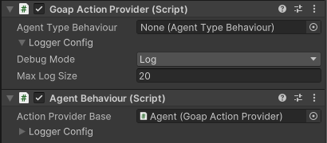
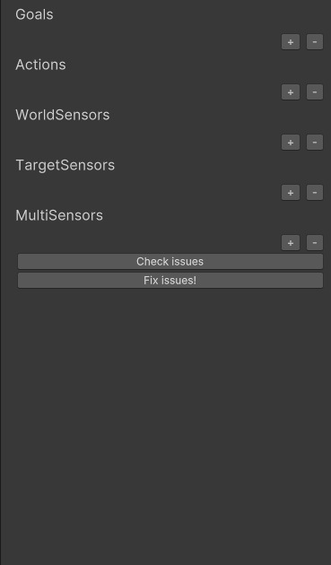
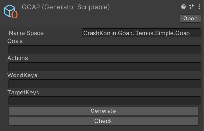
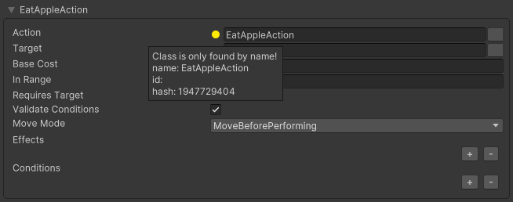
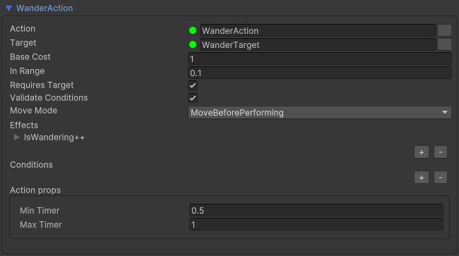

# Core changes for v3!


**Version** For v3 support for 2021.x is dropped. This package was build using unity 2022.2. Any newer version should work!


## Goap Resolver

For v3 the GOAP resolver has been greatly improved, resulting in even smarter AI!

The following improvements have been made:

- The resolver has improved heuristics, making it easier to find the best action to perform.
- The resolver now also supports multiple goals at the same time! 
- The resolver has improved handling of actions that require a target.
- The resolver now supports disabling actions. These actions (and their children) will not be considered by the resolver.
- The resolver now better calculates the distance cost between actions!

## Agents and Action Providers

In v3, we've introduced the concept of **Agents** and **Action Providers**. Agents are the entities that perform actions on your behalf, while Action Providers are the entities that provide the actions that Agents can perform. In v2, these concepts were combined in the **AgentBehaviour**.

In the future, we plan to introduce more types of providers.



### AgentBehaviour

The **AgentBehaviour** only knows how to perform actions. It doesn't know how to decide which actions to perform. All it does is take an action and perform it. All goap related methods (such as SetGoal) have been moved to the **GoapActionProvider** class.

The **AgentBehaviour** doesn't know about the **GoapActionProvider**, it only knows about a simple **IActionProvider**.

### GoapActionProvider

The **GoapActionProvider** is a new class that provides the actions that an Agent can perform. It is responsible for deciding which actions to perform and when to perform them. It also contains all the goap related methods that were previously in the **AgentBehaviour** class.

The **GoapActionProvider** doesn't know about the **AgentBehaviour**, it only knows about a simple **IActionReceiver**.

## AgentType and Capabilities

In v3, we've introduced the concept of **AgentType** (previously known as **GoapSet**) and **Capabilities**. An **AgentType** holds a list of **Capabilities**. A **Capability** is a collection of **Goals**, **Actions** and **Sensors** that an Agent can use.

This makes it easier to create different types of Agents that share some common goals, actions and sensors.

### Scriptable AgentTypes

Scriptable **AgentTypes** not only allow you to define scriptable object **Capabilities**, but you can also add a script that extends from **ScriptableCapabilityFactoryBase**. This allows you to create **Capabilities** in code and add them to the scriptable **AgentType** as well!

### Scriptable Capabilities

Scriptable Capabilities are a new feature in v3. They allow you to define **Capabilities** in a scriptable object. This config file can configure multiple **Goals**, **Actions** and **Sensors** at the same time. This makes it easier to create and manage **Capabilities**.



## Boiler plate code generation

In v3, we've introduced a new code generation system. This system can boilerplate code for all **Goals**, **Actions** and **Sensors** in your configuration. You can simply add a new **Goal**, **Action** or **Sensor** to your configuration and the code generation system will create the boilerplate code for you.

You also manually let it generate many classes for you easily by using the **GeneratorScriptable**.



### GoapId

In v3, we've introduced the concept of a **GoapId**. This is a unique identifier for each **Goal**, **Action** and **Sensor**. This makes it easier to reference these objects in the inspector. When a class has the `[GoapId]` attribute it will keep the reference to that object even if the class is moved to another namespace or renamed!

A class reference in the inspector is now done by using the classname and the GoapId. As long as one of these matches a script the system can restore these references to the correct object. You can fix most issues by using the **Check Issues** and **Fix Issues** buttons in the inspector!

```csharp
[GoapId("HasApple-60e317a0-75e4-419c-8439-45873af983a2")]
public class HasApple : WorldKeyBase {}
```




## Namespaces

In v3, we've introduced simpler namespaces to better organize the code. All namespaces have been renamed to follow a consistent pattern.

```csharp
// All GOAP classes
using CrashKonijn.Goap.Runtime;
// All GOAP related interfaces
using CrashKonijn.Goap.Core;
// All agent classes
using CrashKonijn.Agent.Runtime;
// All agent related interfaces
using CrashKonijn.Agent.Core;
```

## Actions

In v3 we've spent a lot of time improving the **Actions**. We've added a lot of new features that make them more powerful and easier to use.

Main changes:
- Conditions for actions are now re-validated every frame before the action is performed! Only the required sensors are checked.
- In addition to **OnStop**, **OnCompleted** and **OnEnd** events/methods have been introduced!
- The **BeforePerform** method has been added. This is called the first time the action is performed.
- The **ActionContext** has been changed to **IActionContext**.
- The **InRange** config has been renamed to **StoppingDistance**.
- The **RequiresTarget** setting has been added. This setting determines if the action requires a target to be set before it can be performed.
- The **ValidateConditions** setting has been added. This setting determines if the conditions should be re-validated every frame before the action is performed.
- Actions can now be **Disabled**!

```csharp
public class ExampleAction : GoapActionBase<ExampleAction.Data>
{
    // This method is called when the action is created
    // This method is optional and can be removed
    public override void Created()
    {
    }

    // This method is called every frame before the action is performed
    // If this method returns false, the action will be stopped
    // This method is optional and can be removed
    public override bool IsValid(IActionReceiver agent, Data data)
    {
        return true;
    }

    // This method is called when the action is started
    // This method is optional and can be removed
    public override void Start(IMonoAgent agent, Data data)
    {
    }

    // This method is called once before the action is performed
    // This method is optional and can be removed
    public override void BeforePerform(IMonoAgent agent, Data data)
    {
    }

    // This method is called every frame while the action is running
    // This method is required
    public override IActionRunState Perform(IMonoAgent agent, Data data, IActionContext context)
    {
        return ActionRunState.Completed;
    }

    // This method is called when the action is completed
    // This method is optional and can be removed
    public override void Complete(IMonoAgent agent, Data data)
    {
    }

    // This method is called when the action is stopped
    // This method is optional and can be removed
    public override void Stop(IMonoAgent agent, Data data)
    {
    }

    // This method is called when the action is completed or stopped
    // This method is optional and can be removed
    public override void End(IMonoAgent agent, Data data)
    {
    }

    // The action class itself must be stateless!
    // All data should be stored in the data class
    public class Data : IActionData
    {
        public ITarget Target { get; set; }
    }
}
```

- The concept of an **IActionProperties** class has been introduced. This class can be used to store properties that are shared between all instances of an action. These properties can be set in the inspector or in the builder!



```csharp
// Set the second generic type for the properties
public class WanderAction : GoapActionBase<WanderAction.Data, WanderAction.Props>
{
    public override void Start(IMonoAgent agent, Data data)
    {
        // Read the properties that have been set in the inspector or builder
        var wait = Random.Range(this.Properties.minTimer, this.Properties.maxTimer);
        
        // Create a Wait run state. This will wait for the specified time before continueing to perform the action.
        data.Timer = ActionRunState.Wait(wait);
    }

    public override IActionRunState Perform(IMonoAgent agent, Data data, IActionContext context)
    {
        // Check if the timer is still running
        if (data.Timer.IsRunning())
            // Return the timer run state
            return data.Timer;
        
        return ActionRunState.Completed;
    }

    public override void Stop(IMonoAgent agent, Data data)
    {
    }

    public override void Complete(IMonoAgent agent, Data data)
    {
    }

    [Serializable]
    public class Props : IActionProperties
    {
        public float minTimer;
        public float maxTimer;
    }

    public class Data : IActionData
    {
        public ITarget Target { get; set; }
        public IActionRunState Timer { get; set; }
    }
}
```

- **ActionRunState** has been changed to **IActionRunState**. This interface can be used to create custom run states for actions. These determine when an action should be stopped, completed or even be updated at all.

```csharp
public interface IActionRunState
{
    void Update(IAgent agent, IActionContext context);
    bool ShouldStop(IAgent agent);
    bool ShouldPerform(IAgent agent);
    bool IsCompleted(IAgent agent);
    bool MayResolve(IAgent agent);
    bool IsRunning();
}
```

A couple different action run states have been provided out of the box:

```csharp
public static class ActionRunState {
    public static readonly IActionRunState Continue = new ContinueActionRunState();
    public static readonly IActionRunState ContinueOrResolve = new ContinueOrResolveActionRunState();
    public static readonly IActionRunState Stop = new StopActionRunState();
    public static readonly IActionRunState Completed = new CompletedActionRunState();
    public static IActionRunState Wait(float time, bool mayResolve = false) => new WaitActionRunState(time, mayResolve);
    public static IActionRunState WaitThenComplete(float time, bool mayResolve = false) => new WaitThenCompleteActionRunState(time, mayResolve);
    public static IActionRunState WaitThenStop(float time, bool mayResolve = false) => new WaitThenStopActionRunState(time, mayResolve);
    public static IActionRunState StopAndLog(string message) => new StopAndLog(message);
}
```

## All new Graph Viewer!

In v3, we've introduced a new Graph Viewer. This viewer allows you to see the current state of the GOAP graph in real-time. You can see all the nodes and connections between them.

Unlike the previous version this viewer simply shows the graph of the selected object in the editor. This can be an **AgentTypes** and **Capabilities**, no matter if they are in the scene or not! During and outside of play mode!


## Goals

In v3 we've spent a lot of time improving the **Goals**. We've added a lot of new features that make them more powerful and easier to use.

Main changes:
- **Goals** are now **requested** instead of **set**. The currently running action will only be changed if an executable action is found.
- You can now request **multiple** goals at the same time. The resolver will pick the best action to perform for any of the requested goals.
- Goals now have a **BaseCost** setting.

```csharp
this.GetComponent<GoapActionProvider>().RequestGoal<CleanItemsGoal, FixHungerGoal, WanderGoal>(true);
```

## Sensor runner
The sensor runner has been upgraded, it now only runs the sensors that are required for the currently requested goals!

## Sensors
Sensor have been improved in v3, giving you more control over how they work!

### Sensor Timer
In v3 you can now set a timer for each sensor. This timer determines how often the sensor should be run. This makes it easier to create sensors that don't need to be run every frame.

By default three timers are available:

```csharp
public static class SensorTimer
{
    public static AlwaysSensorTimer Always { get; } = new(); // Runs every time it is called
    public static OnceSensorTimer Once { get; } = new(); // Runs only once
    public static IntervalSensorTimer Interval(float interval) => new(interval); // Runs every x seconds
}
```

```csharp
public class AgentSensor : LocalTargetSensorBase
{
    // You can override the timer for the sensor
    public override ISensorTimer Timer { get; } = SensorTimer.Once;

    public override void Created()
    {
    }

    public override void Update()
    {
    }

    public override ITarget Sense(IActionReceiver agent, IComponentReference references, ITarget target)
    {
        return new TransformTarget(agent.Transform);
    }
}
```

### Previous Target
In v3 you now get access to the previous `ITarget` instance that was returned in the target sense method, allowing you to re-use it in the next frame!

## Multi-Sensors

In v3 we've introduced the concept of **Multi-Sensors**. A **Multi-Sensor** is a sensor that can return multiple values at the same time. This makes it easier to create sensors that return multiple values.

```csharp
public class AppleSensor : MultiSensorBase
{
    private AppleCollection apples;
    private TreeBehaviour[] trees;

    public override void Created()
    {
        this.apples = Object.FindObjectOfType<AppleCollection>();
        this.trees = Object.FindObjectsOfType<TreeBehaviour>();
    }

    public override void Update()
    {
        
    }

    public AppleSensor()
    {
        this.AddLocalTargetSensor<ClosestApple>((agent, references) =>
        {
            var closestApple = this.apples.Get().Closest(agent.Transform.position);

            if (closestApple is null)
                return null;
        
            return new TransformTarget(closestApple.transform);
        });
        
        this.AddLocalTargetSensor<ClosestTree>((agent, references) =>
        {
            return new TransformTarget(this.trees.Closest(agent.Transform.position).transform);
        });
        
        this.AddLocalWorldSensor<HasApple>((agent, references) =>
        {
            var inventory = references.GetCachedComponent<InventoryBehaviour>();

            if (inventory == null)
                return false;
            
            return inventory.Apples.Count > 0;
        });
        
        this.AddGlobalWorldSensor<ThereAreApples>(() =>
        {
            return this.apples.Any();
        });
    }
}
```

## Goap Controllers

In v3 we've introduced the concept of **Goap Controllers**. A **Goap Controller** is a class that has controll over how the GOAP system is run. It handles when and how the sensors and resolver are run, enabling new kinds of behaviours!

Each **GoapBehaviour** requires a **Goap Controller** to be set. This controller will determine how the GOAP system is run.

We've introduced 3 different controllers:
- **ReactiveController** - This controller handles sensors and the resolver equal to how it was done in v2. Whenever an agent needs a new action the resolver is called.
- **ProactiveController** - This controller handles sensors and the resolver in a proactive way. It will run the sensors and resolver every x time, even if the agent doesn't need a new action. If another action is found, the agent will switch to that action.
- **ManualController** - This controller allows you to manually run the sensors and resolver. This will immediately run the sensors and resolver whenever a resolve is requested by an agent. 

```csharp
public class ReactiveController : IGoapController
{
    private IGoap goap;
    private Dictionary<IAgentType, HashSet<IMonoGoapActionProvider>> agents = new();

    public void Initialize(IGoap goap)
    {
        this.goap = goap;
        this.goap.Events.OnAgentResolve += this.OnAgentResolve;
        this.goap.Events.OnNoActionFound += this.OnNoActionFound;
    }

    public void Disable()
    {
        this.goap.Events.OnAgentResolve -= this.OnAgentResolve;
        this.goap.Events.OnNoActionFound -= this.OnNoActionFound;
    }

    public void OnUpdate()
    {
        foreach (var (type, runner) in this.goap.AgentTypeRunners)
        {
            var queue = this.GetQueue(type);
            
            runner.Run(queue);
            
            queue.Clear();
        }
        
        foreach (var agent in this.goap.Agents)
        {
            if (agent.IsNull())
                continue;
            
            if (agent.Receiver == null)
                continue;
            
            // Update the action sensors for the agent
            agent.AgentType.SensorRunner.SenseLocal(agent, agent.Receiver.ActionState.Action as IGoapAction);
        }
    }

    public void OnLateUpdate()
    {
        foreach (var runner in this.goap.AgentTypeRunners.Values)
        {
            runner.Complete();
        }
    }

    private void OnNoActionFound(IMonoGoapActionProvider actionProvider, IGoalRequest request)
    {
        this.GetQueue(actionProvider.AgentType).Add(actionProvider);
    }

    private void OnAgentResolve(IMonoGoapActionProvider actionProvider)
    {
        this.GetQueue(actionProvider.AgentType).Add(actionProvider);
    }
    
    private HashSet<IMonoGoapActionProvider> GetQueue(IAgentType agentType)
    {
        if (!this.agents.ContainsKey(agentType))
            this.agents.Add(agentType, new HashSet<IMonoGoapActionProvider>());
        
        return this.agents[agentType];
    }
}
```
