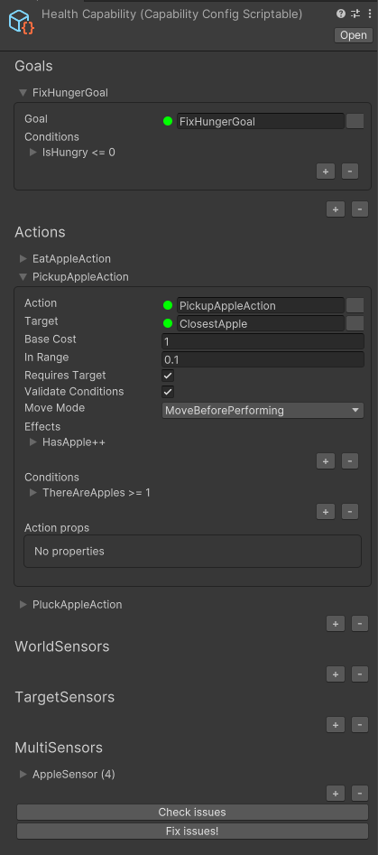

# Core changes for v3!

## Agents and Action Providers

In v3, we've introduced the concept of **Agents** and **Action Providers**. Agents are the entities that perform actions on your behalf, while Action Providers are the entities that provide the actions that Agents can perform. In v2, these concepts were combined in the **AgentBehaviour**.

In the future, we plan to introduce more types of providers.


### AgentBehaviour

The **AgentBehaviour** only knows how to perform actions. It doesn't know how to decide which actions to perform. All it does is take an action and perform it. All goap related methods (such as SetGoal) have been moved to the **GoapActionProvider** class.

The **AgentBehaviour** doesn't know about the **GoapActionProvider**, it only knows about a simple **IActionProvider**.

### GoapActionProvider

The **GoapActionProvider** is a new class that provides the actions that an Agent can perform. It is responsible for deciding which actions to perform and when to perform them. It also contains all the goap related methods that were previously in the **AgentBehaviour** class.

The **GoapActionProvider** doesn't know about the **AgentBehaviour**, it only knows about a simple **IActionReceiver**.

## AgentType and Capabilities

In v3, we've introduced the concept of **AgentType** (previously known as **GoapSet**) and **Capabilities**. An **AgentType** holds a list of **Capabilities**. A **Capability** is a collection of **Goals**, **Actions** and **Sensors** that an Agent can use.

This makes it easier to create different types of Agents that share some common goals, actions and sensors.

### Scriptable AgentTypes

Scriptable **AgentTypes** not only allow you to define scriptable object **Capabilities**, but you can also add a script that extends from **ScriptableCapabilityFactoryBase**. This allows you to create **Capabilities** in code and add them to the scriptable **AgentType** as well!

### Scriptable Capabilities

Scriptable Capabilities are a new feature in v3. They allow you to define **Capabilities** in a scriptable object. This config file can configure multiple **Goals**, **Actions** and **Sensors** at the same time. This makes it easier to create and manage **Capabilities**.



## Boiler plate code generation

In v3, we've introduced a new code generation system. This system can boilerplate code for all **Goals**, **Actions** and **Sensors** in your configuration. You can simply add a new **Goal**, **Action** or **Sensor** to your configuration and the code generation system will create the boilerplate code for you.

You also manually let it generate many classes for you easily by using the **GeneratorScriptable**.


## Namespaces

In v3, we've introduced simpler namespaces to better organize the code. All namespaces have been renamed to follow a consistent pattern.

```csharp
// All GOAP classes
using CrashKonijn.Goap.Runtime;
// All GOAP related interfaces
using CrashKonijn.Goap.Core;
// All agent classes
using CrashKonijn.Agent.Runtime;
// All agent related interfaces
using CrashKonijn.Agent.Core;
```

## Actions

In v3 we've spent a lot of time improving the **Actions**. We've added a lot of new features that make them more powerful and easier to use.

Main changes:
- Conditions for actions are now re-validated every frame before the action is performed! Only the required sensors are checked.
- In addition to **OnStop**, **OnCompleted** and **OnEnd** events/methods have been introduced!
- The **BeforePerform** method has been added. This is called the first time the action is performed.
- The **ActionContext** has been changed to **IActionContext**.
- The **InRange** config has been renamed to **StoppingDistance**.
- The **RequiresTarget** setting has been added. This setting determines if the action requires a target to be set before it can be performed.
- The **ValidateConditions** setting has been added. This setting determines if the conditions should be re-validated every frame before the action is performed.
- Actions can now be **Disabled**!

```csharp
public class ExampleAction : GoapActionBase<ExampleAction.Data>
{
    // This method is called when the action is created
    // This method is optional and can be removed
    public override void Created()
    {
    }

    // This method is called every frame before the action is performed
    // If this method returns false, the action will be stopped
    // This method is optional and can be removed
    public override bool IsValid(IActionReceiver agent, Data data)
    {
        return true;
    }

    // This method is called when the action is started
    // This method is optional and can be removed
    public override void Start(IMonoAgent agent, Data data)
    {
    }

    // This method is called once before the action is performed
    // This method is optional and can be removed
    public override void BeforePerform(IMonoAgent agent, Data data)
    {
    }

    // This method is called every frame while the action is running
    // This method is required
    public override IActionRunState Perform(IMonoAgent agent, Data data, IActionContext context)
    {
        return ActionRunState.Completed;
    }

    // This method is called when the action is completed
    // This method is optional and can be removed
    public override void Complete(IMonoAgent agent, Data data)
    {
    }

    // This method is called when the action is stopped
    // This method is optional and can be removed
    public override void Stop(IMonoAgent agent, Data data)
    {
    }

    // This method is called when the action is completed or stopped
    // This method is optional and can be removed
    public override void End(IMonoAgent agent, Data data)
    {
    }

    // The action class itself must be stateless!
    // All data should be stored in the data class
    public class Data : IActionData
    {
        public ITarget Target { get; set; }
    }
}
```

- The concept of an **IActionProperties** class has been introduced. This class can be used to store properties that are shared between all instances of an action. These properties can be set in the inspector or in the builder!
- **ActionRunState** has been changed to **IActionRunState**. This interface can be used to create custom run states for actions. These determine when an action should be stopped, completed or even be updated at all.

```csharp
// Set the second generic type for the properties
public class WanderAction : GoapActionBase<WanderAction.Data, WanderAction.Props>
{
    public override void Start(IMonoAgent agent, Data data)
    {
        // Read the properties that have been set in the inspector or builder
        var wait = Random.Range(this.Properties.minTimer, this.Properties.maxTimer);
        
        // Create a Wait run state. This will wait for the specified time before continueing to perform the action.
        data.Timer = ActionRunState.Wait(wait);
    }

    public override IActionRunState Perform(IMonoAgent agent, Data data, IActionContext context)
    {
        // Check if the timer is still running
        if (data.Timer.IsRunning())
            // Return the timer run state
            return data.Timer;
        
        return ActionRunState.Completed;
    }

    public override void Stop(IMonoAgent agent, Data data)
    {
    }

    public override void Complete(IMonoAgent agent, Data data)
    {
    }

    [Serializable]
    public class Props : IActionProperties
    {
        public float minTimer;
        public float maxTimer;
    }

    public class Data : IActionData
    {
        public ITarget Target { get; set; }
        public IActionRunState Timer { get; set; }
    }
}
```

## All new Graph Viewer!

In v3, we've introduced a new Graph Viewer. This viewer allows you to see the current state of the GOAP graph in real-time. You can see all the nodes and connections between them.

Unlike the previous version this viewer simply shows the graph of the selected object in the editor. This can be an **AgentTypes** and **Capabilities**, no matter if they are in the scene or not! During and outside of play mode!


## Goals

In v3 we've spent a lot of time improving the **Goals**. We've added a lot of new features that make them more powerful and easier to use.

Main changes:
- **Goals** are now **requested** instead of **set**. The currently running action will only be changed if an executable action is found.
- You can now request **multiple** goals at the same time. The resolver will pick the best action to perform for any of the requested goals.
- Goals now have a **BaseCost** setting.

```csharp
this.GetComponent<GoapActionProvider>().RequestGoal<CleanItemsGoal, FixHungerGoal, WanderGoal>(true);
```

## Multi-Sensors

## Goap Controllers

## Goap Resolver

## 