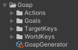

# Upgrade guid v2.1 to v3

Before upgrading, please make sure to read the **v3 Core Concepts**!


**Version** For v3 support for 2021.x is dropped. This package was build using unity 2022.2. Any newer version should work!


## 1. The package
- Remove the v2 package from your project!
- Add the v3 package to your project.

## Add the UpgradeExtensions.cs
- Add this file to your project. This will guide you through the upgrade process:

```csharp
using System;
using CrashKonijn.Agent.Core;
using CrashKonijn.Goap.Core;

namespace CrashKonijn.Goap.Core
{
    [Obsolete("Use IGoal instead")]
    public interface IGoalBase : IGoal {}
    
    [Obsolete("Use IAction instead")]
    public interface IActionBase : IAction {}

    [Obsolete("Use IGoap instead")]
    public interface IGoapRunner : IGoap {}
    
    [Obsolete("Use IAgentTypeConfig instead")]
    public interface IGoapSetConfig : IAgentTypeConfig {}
    
    [Obsolete("This doesn't exist anymore")]
    public interface IAgentDebugger {}

    public static class UpgradeExtensions
    {
        [Obsolete("Use GetAgentType instead")]
        public static object GetGoapSet(this IGoap goap, string id) => default;
    }
}

namespace CrashKonijn.Goap.Runtime
{
    [Obsolete("Use GoapBehaviour instead")]
    public class GoapRunnerBehaviour : GoapBehaviour, IGoapRunner {}
    
    [Obsolete("Use CapabilityFactoryBase instead")]
    public abstract class GoapSetFactoryBase : CapabilityFactoryBase {}
    
    [Obsolete("Use CapabilityBuilder instead")]
    public class GoapSetBuilder : CapabilityBuilder
    {
        public GoapSetBuilder(string name) : base(name)
        {
        }
    }
    
    public static class UpgradeExtensions
    {
        [Obsolete("This doesn't exist anymore")]
        public static void SetAgentDebugger<T>(this GoapSetBuilder builder) {}
        [Obsolete("This doesn't exist anymore")]
        public static void SetAgentDebugger<T>(this CapabilityBuilder builder) {}
    }
}

namespace CrashKonijn.Agent.Runtime
{
    public static class UpgradeExtensions
    {
        [Obsolete("Use GoapActionProvider.RequestGoal instead")]
        public static void SetGoal<T>(this IAgent agent, bool stopAction = true)
        {
        }
        [Obsolete("Use GoapActionProvider.RequestGoal instead")]
        public static void SetGoal(this IAgent agent, IGoal goal, bool stopAction = true)
        {
        }
    }
}
```

## 2. Namespaces
Remove all `CrashKonijn.Goap.X` namespaces. They have been simplified and all possible classes now live under these 4 namespaces.
In every script that used the old namespaces, paste these 4 in. You can remove any that you don't use.

```csharp
using CrashKonijn.Goap.Runtime;
using CrashKonijn.Goap.Core;
using CrashKonijn.Agent.Runtime;
using CrashKonijn.Agent.Core;
```

## 3. AgentBehaviour and ActionProvider
In v3 the **AgentBehaviour** has been split into the **AgentBehaviour** and the **GoapActionProvider**. Any GOAP specific data, methods and events have been moved over to the **GoapActionProvider**.

- In any script where you're using GOAP related data, actions and events make sure to also get a reference to the **GoapActionProvider**. Change the GOAP reference to the new action provider.

```csharp
var agent = this.GetComponent<AgentBehaviour>();
var provider = this.GetComponent<GoapActionProvider>();

provider.RequestGoal<FixHungerGoal>();

Debug.Log(agent.ActionState.Action)
Debug.Log(provider.CurrentPlan.Goal)

agent.Events.OnTargetInRange += this.OnTargetInRange;
agent.Events.OnTargetChanged += this.OnTargetChanged;

provider.Events.OnNoActionFound += this.OnNoActionFound;
provider.Events.OnGoalCompleted += this.OnGoalCompleted;
```

## Actions
- Extend from `GoapActionBase` instead of `ActionBase`.
- Change the signature from the `Perform` method to the new signature.
    - `ActionRunState` is now `IActionRunState`
    - `ActionContext` is now `IActionContext`
  
```csharp
// Old
public override ActionRunState Perform(IMonoAgent agent, Data data, ActionContext context)

// New
public override IActionRunState Perform(IMonoAgent agent, Data data, IActionContext context)
```

## Sensors
- In any sensor that extends **LocalTargetSensorBase** or **LocalWorldSensorBase**, change the `IMonoAgent` variable in the `Sense` method to `IActionReceiver`.
- If you use any references to `.transform` or `.gameObject`, please use `.Transform` or `.Transform.GameObject`

## GoapConfigInitializer
- The `GoapConfig` parameter has been replaced with `IGoapConfig`

## GoapInjector
- `IActionBase` has been replaced with `IAction`
- `IGoalBase` has been replaced with `IGoal`
- Both `IWorldSensor` and `ITargetSensor` methods have been replaced with the `ISensor` method.

## Factories
**GoapSets** have been split into **AgentTypes** and **Capabilities**. The easest way to upgrade is to convert **GoapSetFactoryBase** clases to **CapabilityFactoryBase** classes.

- Optional: Rename any reference to `GoapSet` in the name of the class to `Capability` 
- Change `GoapSetFactoryBase` to `CapabilityFactoryBase`
- Change the `IGoapSetConfig` return type of the `Create` method to `ICapabilityConfig`
- Change the `GoapSetBuilder` to `CapabilityBuilder`
- The `AgentDebugger` has be removed

### Create the AgentTypeFactory

Create the AgentTypeFactory, and add the capability factory you've just upgraded.

Below is an example from the demo.
```csharp
public class CleanerAgentTypeFactory : AgentTypeFactoryBase
{
    public override IAgentTypeConfig Create()
    {
        var builder = new AgentTypeBuilder(SetIds.Cleaner);
        
        builder.AddCapability<BaseCapability>();
        builder.AddCapability<WanderCapability>();
        builder.AddCapability<HungerCapability>();

        builder.CreateCapability("CleanCapability", (capability) =>
        {
            capability.AddGoal<CleanItemsGoal>()
                .SetBaseCost(20)
                .AddCondition<ItemsOnFloor>(Comparison.SmallerThanOrEqual, 0);
            
            capability.AddAction<HaulItemAction>()
                .SetTarget<HaulTarget>()
                .AddEffect<ItemsOnFloor>(EffectType.Decrease)
                .AddCondition<ItemsOnFloor>(Comparison.GreaterThanOrEqual, 1)
                .SetMoveMode(ActionMoveMode.PerformWhileMoving);
            
            capability.AddWorldSensor<ItemOnFloorSensor>()
                .SetKey<ItemsOnFloor>();

            capability.AddTargetSensor<HaulTargetSensor>()
                .SetTarget<HaulTarget>();
        });

        return builder.Build();
    }
}
```

## Fixing all errors and obsolete issues
- Fix all **errors** in your code.
- After it compiles, make sure you fix all **obsolete** warnings.

## Updating prefabs

### GoapRunnerBehaviour
- The **GoapRunnerBehaviour** has been renamed to **GoapBehaviour**. Make sure to replace it.
- Each **GoapBehaviour** needs a **GoapController**. Add the **ReactiveController** or the **ProactiveController** to the same GameObject. The **ReactiveController** behaves the same as in v2.
- Remove your old **GoapSet** script from the GameObject.
- Add your new **AgentTypeFactories**. It's advised to use a single child GameObject per AgentType. This ensures you can preview them in the graph viewer.

### GoapSetBehaviours (for scriptable configs)
- Make sure you've added the **AgentTypeBehaviour** to any GameObject that has the **GoapSetBehaviour** component.
- Copy your settings to the new script and remove the **GoapSetBehaviour** scripts.
- For each **AgentType**, create a scriptable **AgentTypeConfig** using `create > Goap > AgentTypeConfig`. Give the file the name of your new agent type.
- Reference your new AgentType scriptable on the **AgentTypeBehaviour**

### Agent
- On your agent prefabs make sure to add the **GoapActionProvider** script.
- Reference your new **GoapActionProvider** script in the `ActionProviderBase` value on the **AgentBehaviour**
- When using scriptable configs, reference the correct **AgentTypeBehaviour** on the **GoapActionProvider**

## Remove the UpgradeExtensions file
At this point the UpgradeExtensions should not be needed anymore, please remove it.

## MoveBehaviour
In v2 the `OnTargetChanged` event would also be called with null, in v3 the `OnTargetLost` event gets called instead if the target is null. You should implement this event on your move script.

## Generator
The generator can help you quickly boilerplate your new classes. To use the generator please make sure to follow these steps:

- Add a generator to your project by going `right click in your project view > Create > GOAP > Generator`
- In the inspector of the generator set namespace as your root namespace.
    - For example if the namespace for your actions is `CrashKonijn.Example.Actions` than the root namespace is `CrashKonijn.Example`. 
- Make sure the folder structure for `goals`, `actions`, `world keys` and `target keys` match this screenshot. The folders for your `sensors` should also be here, but they don't require a specific name.
- You can press the **Check** button on the generator the view all classes that it can find. Make sure it finds all your classes!



## Scriptable configs

### GoapId's
If you're using scriptable objects as your configuration method you should add `[GoapId]` attributes to your `goal`, `action`, `key` and `sensor` classes. These will help the system keep track of your classes, even when you change their name or namespaces!

```csharp
// This can be any name, as long is is unique
// This is an example of what the generator will create for you when using the geneartor.
[GoapId("WanderTarget-ae7344be-5223-4260-acac-f33c9eb260f5")]
public class WanderTarget : TargetKeyBase {}
```

### Scriptable GoapSet's
There's an automatic upgrader for your scriptable **GoapSets**! For each set do the following:

- Create a new scriptable **CapabilityConfig** using `Create > Goap > CapabilityConfig`. Make sure to match the name of the file to the goap set that you're upgrading. The new **CapabilityConfig** MUST be in a subfolder of a GoapGenerator!
- Select the **GoapSet** and in the inspector assign the new **CapabilityConfig** in the `CapabilityConfig` field above the **Upgrade** button.
- Press the **Upgrade** button!
- Your **CapabilityConfig** should now contain all `goals`, `actions` and `sensors` of your **GoapSet**!
- You can use the **Check Issues** and then **Fix Issues** buttons to see and fix most reference issues.
- Add your **CapabilityConfig** to the correct **AgentType** config.